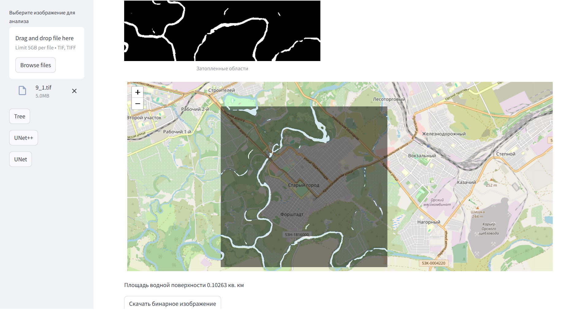

# Кейс: Методы ИИ для решения задач устойчивого развития. Анализ последствий наводнений

https://waterfinder.innino.keenetic.pro/ - на этом сайте можно ознакомиться с работой нашего решения.
https://disk.yandex.ru/d/9qb9GrStkBtfEw -- папка с моделями, содержимое папки надо скопировать в папку skoltech_train, который надо создать на одном уровне со скриптами.
run_web.py - основной скрипт, который надо запустить. 

